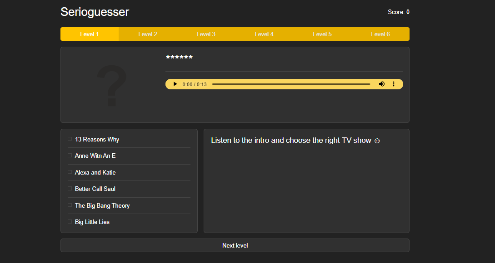
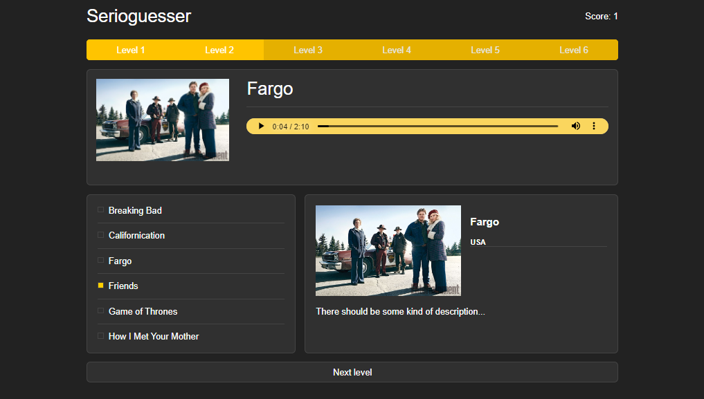

# Serioguesser 

Go ahead and play the game if you love TV shows (well, who doesn't anyway?), that will show you how well you know the industry.
I tried to do a mix up of the most well-know TV shows for the last 20 years or so, but there still might be some you do not not, because of the prejudices view and a want to put my favourites in here.

[Play serioguesser 🎲](https://master--benevolent-sunburst-dbd4f5.netlify.app/)

The same game logic may be applied to any other things with the distinctive melody and sound (music, cartoons, famous people voices etc.)

Hope you enjoy it!

Note: the project have not been finished yet, so some bugs may arise. Sorry! :)

### Challenges faced and things learned during development

- Keep both desktop, tablet and mobile version together, changing the layout with media queries and modern CSS features
- Trying to keep JS consice
- Get to know webpack docs and config file a bit better

### Screenshots

### Built with

- Mighty Javascript
- SCSS that beautifies
- Powerful Webpack

## Acknowledgments

- [Lots of thanks to Harvard University for making education accessible, quite succinct and to the point](https://cs50.harvard.edu/x/2023/)
- Redesigned game idea from [The Rolling Scopes School](https://rs.school/)

## Badges

&nbsp;

&nbsp;

### Notes

Todos:
- add transitions
- tidy up scss
- tidy up JS
- review the data file
